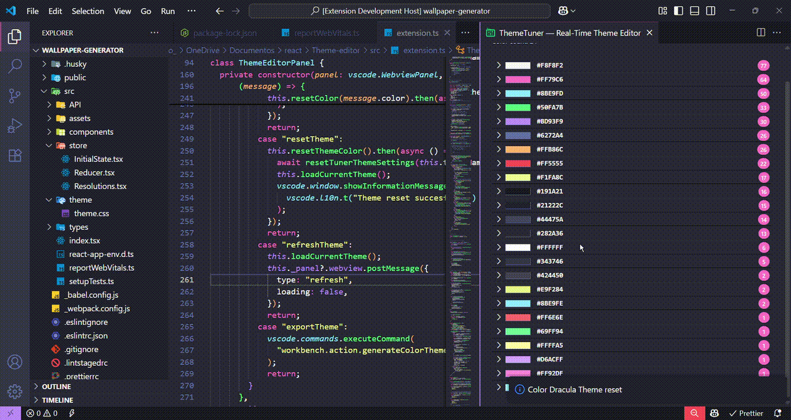

# Theme Editor

Theme editor is a tool to change/fix color in your current theme. It scans all the colors defined in the theme and list it sorted by number of appearences.

## Features

Press (`Cmd+Shift+P` on macOS or `Ctrl+Shift+P` on Windows and Linux) and search for `Open Theme Editor`.

Describe specific features of your extension including screenshots of your extension in action. Image paths are relative to this README file.

For example if there is an image subfolder under your extension project workspace:

\!\[demo\]\(media/demo.mp4\)
\!\[demo\]\(media/demo.gif\)

> Tip: Many popular extensions utilize animations. This is an excellent way to show off your extension! We recommend short, focused animations that are easy to follow.

## Extension Settings

Include if your extension adds any VS Code settings through the `contributes.configuration` extension point.

For example:

This extension contributes the following settings:

- `myExtension.enable`: Enable/disable this extension.
- `myExtension.thing`: Set to `blah` to do something.

## Following extension guidelines

## Working with Markdown

You can author your README using Visual Studio Code. Here are some useful editor keyboard shortcuts:

**Enjoy!**
