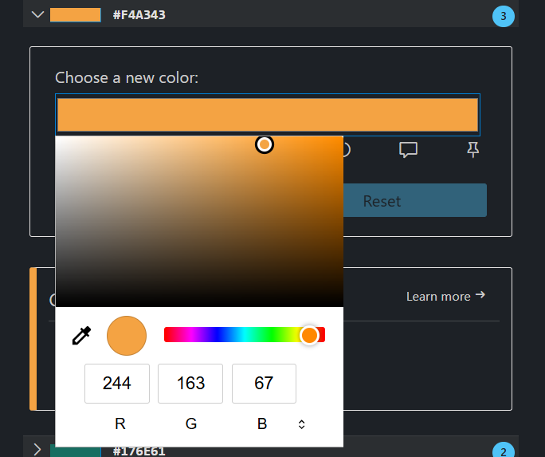
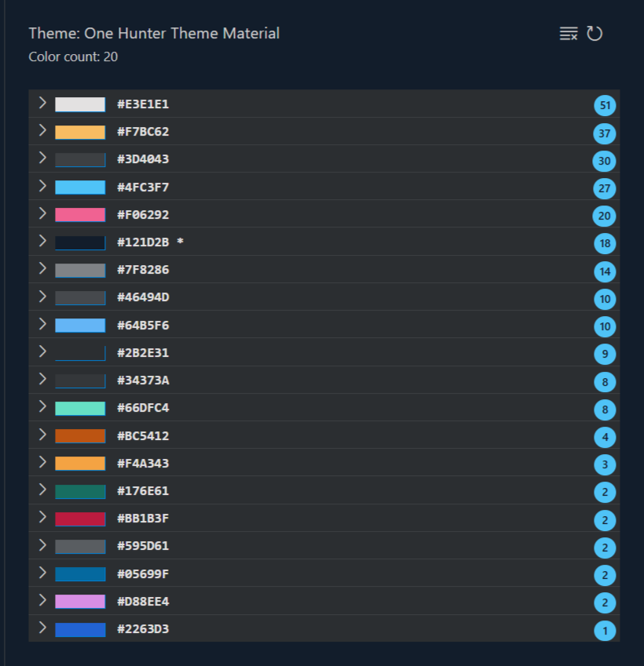
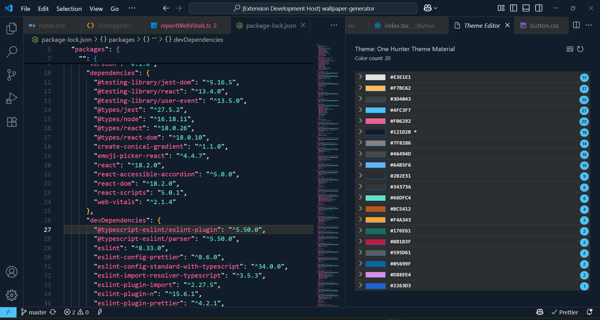

# ThemeTuner

ThemeTuner is a tool to change/fix color in your current theme. It scans all the colors defined in the theme and list it sorted by number of appearences.

## Features

Press (`Cmd+Shift+P` on macOS or `Ctrl+Shift+P` on Windows and Linux) and search for `ThemeTuner: Open ThemeTuner`.

**Enjoy!**
