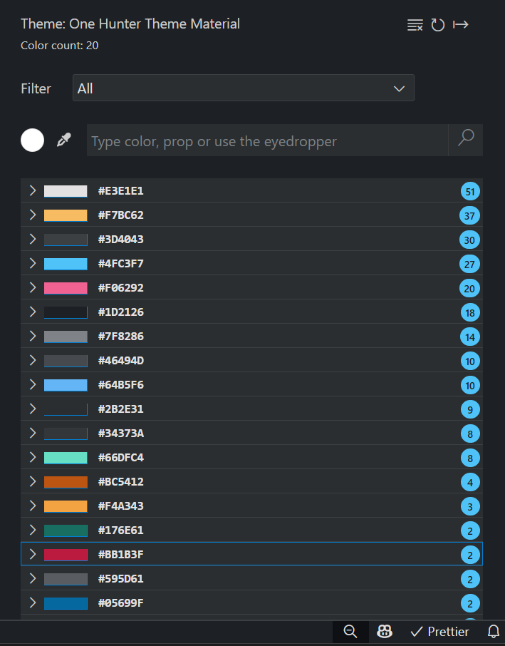

# ThemeTuner

ThemeTuner is a tool to change/fix colors in your current theme. It scans all the colors defined in the theme and list it sorted by number of appearences.

## How to use it

Install ThemeTuner, then press (`Cmd+Shift+P` on macOS or `Ctrl+Shift+P` on Windows and Linux) and type `ThemeTuner: Open ThemeTuner` and ThemeTuner will scan your current color palette automatically. We recommend to split the editor for a better experience debuging changes.

Once you do this you can see something like this:

To modify a diferent theme, switch to another theme using `Cmd+K+T` on macOS or `Ctrl+K+T` on Windows and Linux. It will re-scan the new theme.

# Interface:

This extension has the following structure:

- Current theme name
- Number of available colors
- Reset button (it will override all customizations, even those made without ThemeTuner)
- Refresh button (refresh in case that you made changes without ThemeTuner)
- Color list (Every color has a color box, the hex code and the amount of properties where it is applied)

Check this reference image:

# Tools

Clicking a color and you will see the available tools:

- color picker
- brightness controls
- choose a existing color
- reset color to the original

Click the color picker and choose the color you prefer:

The `*` mark indicates these color has been customized

## See in action

# Considerations

If you need to customize separate properties, go to settings.json to do it manually(Press `Ctrl+,` or `Cmd+,` to go to settings).

ThemeTuner only show a list of the properties defined in your theme. If some property is missing, that means it is not defined and you have to add it manually.

# Future features

Depending on demand, some features are coming(don't forget to rate it):

- property filter
- individual color change
- alpha/transparency modification
- add new filter
- set custom color names

# License

MIT

**Enjoy!**
